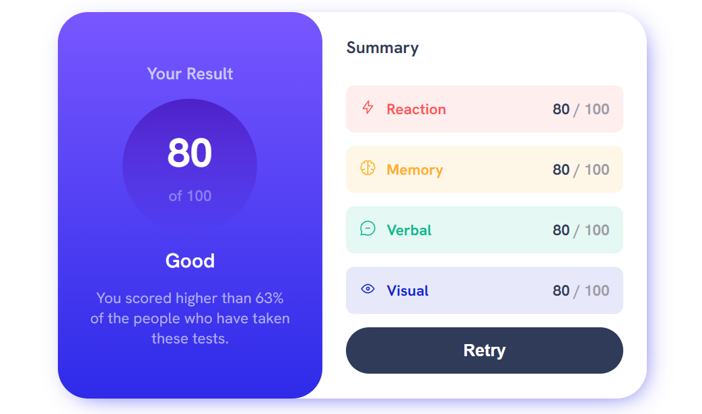

# Frontend Mentor - Results summary component solution

## Table of contents

- [Overview](#overview)
  - [Features](#features)
  - [Screenshot](#screenshot)
  - [Links](#links)
- [My process](#my-process)
  - [Built with](#built-with)
  - [Continued development](#continued-development)
- [Author](#author)
- [Acknowledgments](#acknowledgments)

## Overview

### Features

- Responsive and modern-looking design
- Reusable component
- Dinamically generated data (calculate the result from the 4 categories of the test; calculate the percent of people that scored below the current user)
- Optimized performance with hooks like useMemo and code-spliting

### Screenshot

### Links

- Solution URL: [Add solution URL here](https://your-solution-url.com)
- Live Site URL: [Add live site URL here](https://your-live-site-url.com)

## My process

### Built with

- Mobile-first workflow
- Flexbox
- [React](https://reactjs.org/) - JS library

### Continued development

In the future it will be possible for the user to add tests to the database

## Author

Bozai Cosmin

## Acknowledgments

This is a solution to the [Results summary component challenge on Frontend Mentor](https://www.frontendmentor.io/challenges/results-summary-component-CE_K6s0maV).
