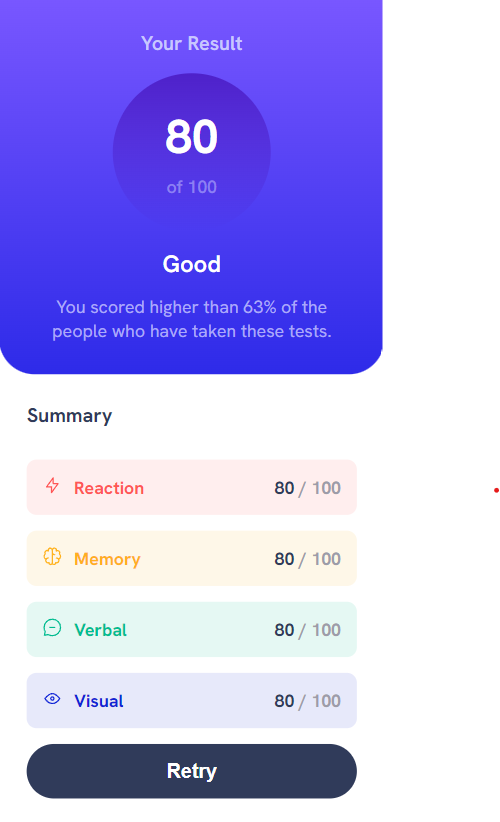

# Frontend Mentor - Results summary component solution

## Table of contents

- [Overview](#overview)
  - [Features](#features)
  - [Screenshot](#screenshot)
  - [Links](#links)
  - [Built with](#built-with)
- [Author](#author)
- [Acknowledgments](#acknowledgments)

## Overview

### Features

This app is a modern, well-designed application built using well established web technologies. It is written in React using SOLID principles, which ensures that the code is clean, maintainable, and easy to understand. The app is divided into modules, making it easy to add new features and update existing ones. It also features reusable components and custom hooks, which help to reduce code duplication and improve the overall quality of the codebase.

One of the standout features of this app is that it is written in TypeScript, a statically-typed superset of JavaScript. This allows for better code reliability, as well as improved tooling and editor support. Additionally, the app has been thoroughly tested using testing libraries, ensuring that it is stable and reliable.

The app has a sleek and modern-looking design, which is fully responsive and optimized for mobile devices. The design was created using SASS and a mobile-first workflow, ensuring that it looks great and functions well on devices of all sizes.

### Screenshot

### Links

- Live Site URL: [Vercel](https://result-summary-component-three.vercel.app/)

### Built with

The app was built using a number of different technologies and tools, including:

- [Vite]("https://vitejs.dev/"): a fast build tool that allows for rapid development and quick feedback loops
- [TypeScript]("https://www.typescriptlang.org/"): a statically-typed superset of JavaScript that provides better code reliability and improved tooling
- [React]("https://react.dev/"): a popular JavaScript library for building user interfaces
- [Sass]("https://sass-lang.com/"): a preprocessor scripting language that extends CSS and provides more features and flexibility
- [Vitest]("https://vitest.dev/"): a testing library specifically designed for use with Vite and Vue applications
- [React Testing Library]("https://testing-library.com/"): a testing utility for React that allows for easy and efficient testing of UI components

## Author

Bozai Cosmin

## Acknowledgments

This is a solution to the [Results summary component challenge on Frontend Mentor](https://www.frontendmentor.io/challenges/results-summary-component-CE_K6s0maV).
